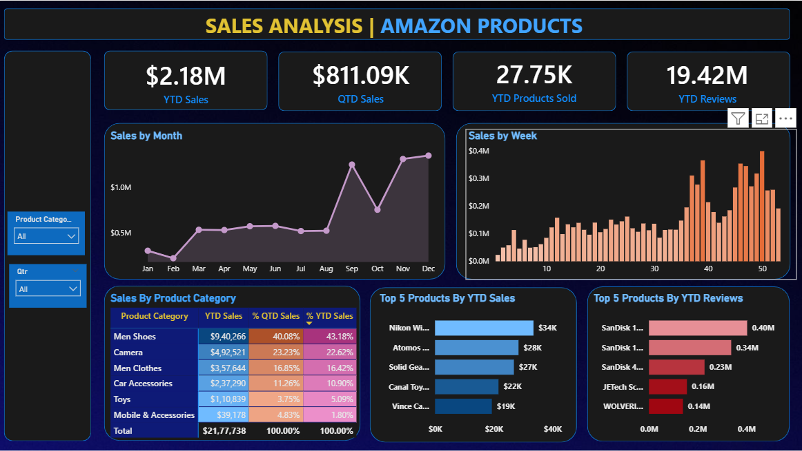

# Amazon-Sales-Analysis
📸 Dashboard Preview
Here’s a snapshot of the Amazon Product Sales Analysis Dashboard:

🖼️ Visual Highlights
🔹 Key Performance Indicators
- YTD Sales: $2.18M
- QTD Sales: $811.09K
- YTD Products Sold: 27.75K
- YTD Reviews: 19.42M
📈 Sales Trends
- Sales by Month: Line chart showing seasonal peaks in September and November.
- Sales by Week: Bar chart highlighting weekly performance spikes.
🗂️ Category Performance
- Table showing YTD and QTD sales breakdown by product category.
🥇 Top Products
- By Sales: Nikon, Atomos, Solid Gear, Canal Toys, Vince Camuto
- By Reviews: SanDisk, JETech, WOLVERINE
🚀 How to Use
- Clone the repository.
- Open the .pbix file in Power BI Desktop.
- Explore the dashboard using filters and visuals.
- Review DAX formulas for learning or customization.
📌 Use Cases
- E-commerce performance tracking
- Product category analysis
- Sales forecasting and planning
- Review sentiment and engagement monitoring
